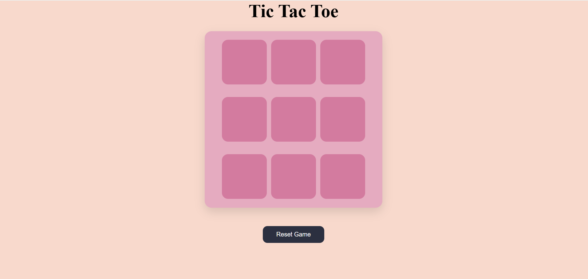
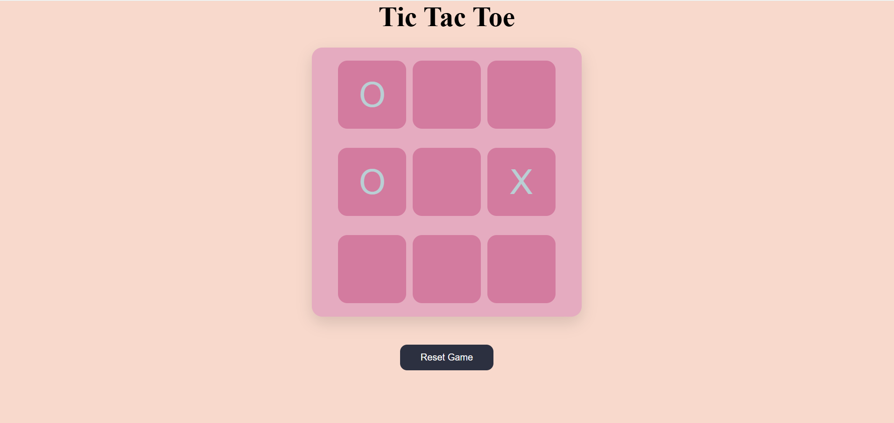
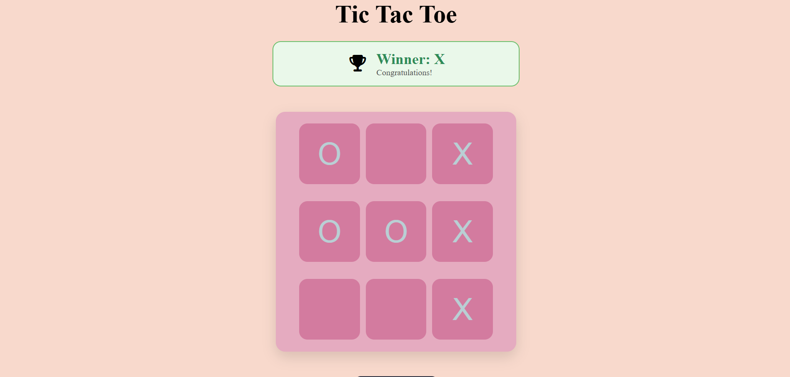
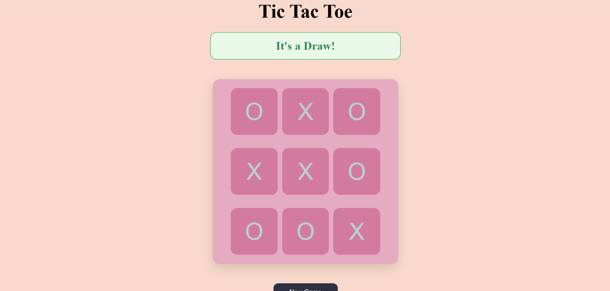

# 🎮 Tic Tac Toe


A responsive and interactive Tic Tac Toe game built using **HTML**, **CSS**, and **JavaScript**. The game features a modern pastel-themed interface, winner detection, draw detection, and options to reset or start a new game.

## 🌐 Live Demo

🔗 https://riyamishra0226.github.io/TicTacToe/

---

## 📸 Screenshots

### Home Screen


### Gameplay Screen


### Winner Screen


### Draw Screen


---

## ✨ Features

- 🎯 Two-player gameplay (Player O and Player X)
- 🏆 Automatic winner detection
- 🤝 Draw detection
- 🔄 Reset Game functionality
- 🆕 New Game option after game completion
- 📱 Responsive layout for desktop and mobile devices
- 🎨 Modern pastel-themed user interface
- ✨ Hover effects and smooth styling

---

## 🛠️ Technologies Used

- HTML5
- CSS3
- JavaScript (ES6)
- DOM Manipulation
- Event Listeners

---

## 📂 Project Structure

```
TicTacToe/
│── screenshots/
│   ├── tictactoe_ss1.png
│   ├── tictactoe_ss2.png
│   ├── tictactoe_ss3.png
│   └── tictactoe_ss4.png
│
├── index.html
├── style.css
├── app.js
└── README.md
```

---

## 🚀 Getting Started

### Clone the repository

```bash
git clone https://github.com/riyamishra0226/TicTacToe.git
```

### Navigate to the project folder

```bash
cd tic-tac-toe
```

### Run the project

Open **index.html** in your browser, or use **Live Server** in Visual Studio Code.

---

## 🎮 How to Play

1. Player **O** starts the game.
2. Players take turns placing **O** and **X**.
3. The first player to align three marks in a row, column, or diagonal wins.
4. If all nine cells are filled without a winner, the game ends in a draw.
5. Use **Reset Game** to restart the current game at any time.
6. After a game ends, click **New Game** to start a fresh match.

---

## 📌 Future Enhancements

- 🔊 Add sound effects
- 🤖 Play against Computer (AI)
- 🌙 Dark Mode
- 📊 Scoreboard
- ✨ Winning line animation
- ⏳ Turn indicator

---

## 👩‍💻 Author

**Riya Mishra**

GitHub: https://github.com/riyamishra0226

---

## ⭐ Support

If you enjoyed this project, consider giving it a ⭐ on GitHub!
